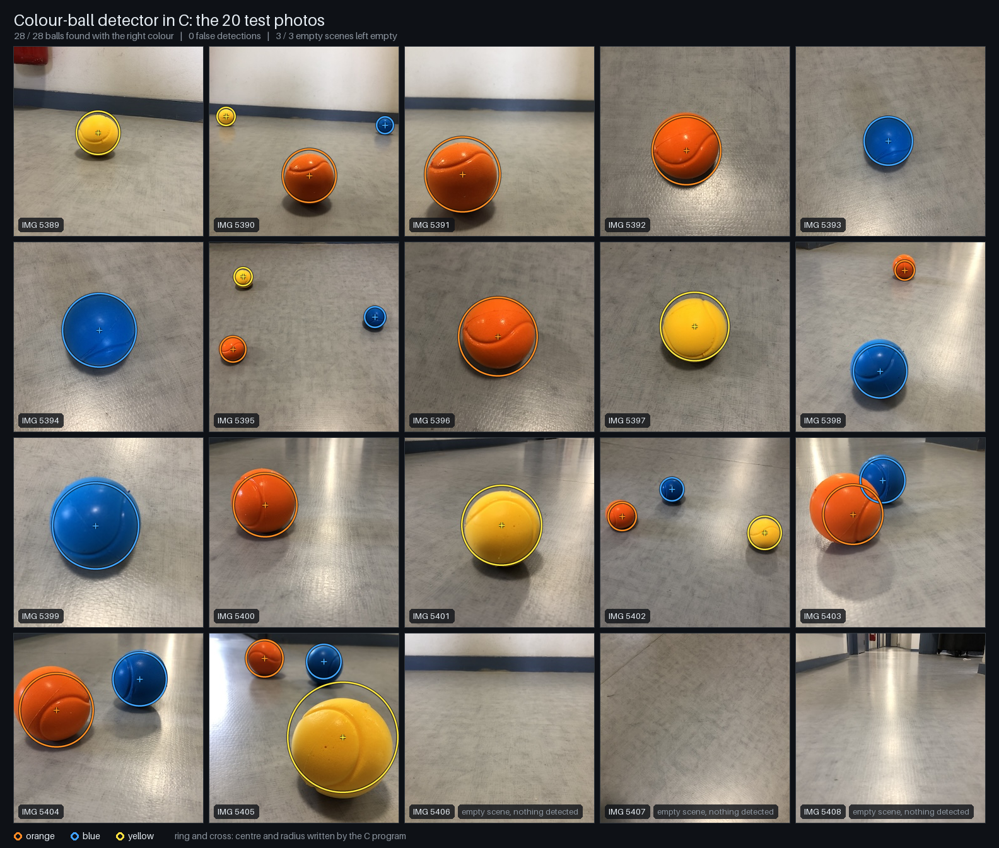
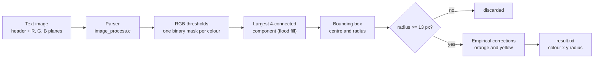
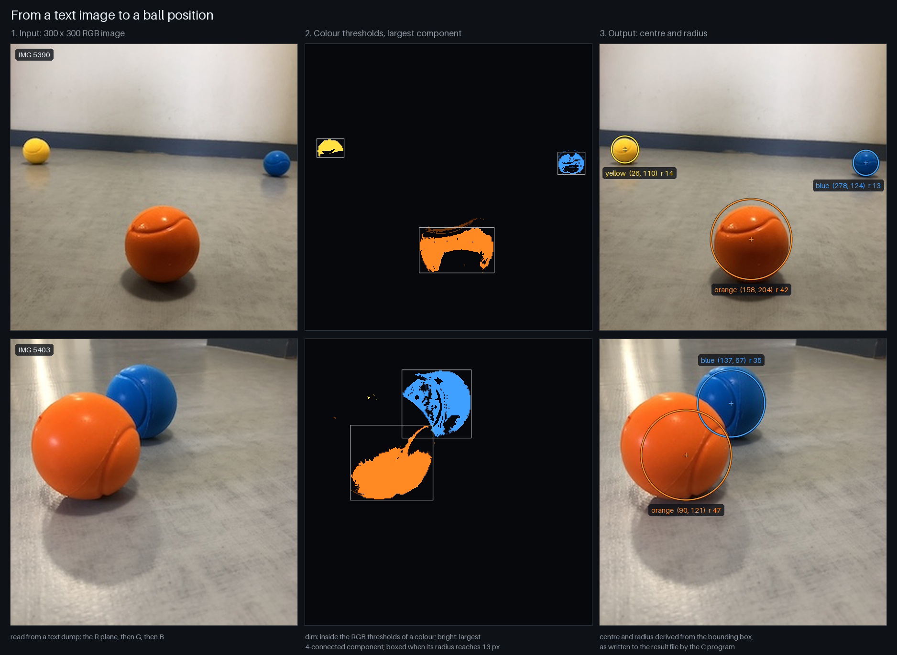

# PFR: colour-ball detector in pure C

[](https://github.com/guilhem0908/PFR/actions/workflows/ci.yml)



A small C11 program that finds orange, blue and yellow balls in a 300 x 300 RGB
image and reports the centre and radius of each one. It uses no vision library:
the image is read from a text dump, segmented with fixed RGB thresholds, reduced
to the largest connected blob of each colour and measured through its bounding
box.

It is the image-processing part of the first half of the *Projet Fil Rouge*
(PFR 1), a project of the first year of the engineering cycle at UPSSITECH, the
engineering school of the University of Toulouse. **Guilhem Carmouze** and
**Alec Bossard** wrote it between 10 and 25 January 2025. In October 2026 the
repository was cleaned up: the tuned version used at the end of the project was
brought in, the defects that remained were fixed, and tests, an evaluation
against reference labels and the figures of this page were added. The second
half of the project, on a real robot, lives in a team repository: see
[Part 2](#part-2-the-real-robot).

## How it works





1. **Input.** The program does not decode image files. It reads a text dump: a
   header line `width height 3`, then the red plane, the green plane and the
   blue plane, each as `height` lines of `width` integers between 0 and 255.
   `IMG_300/` holds 20 photos as JPEG files and as text dumps of about 1 MB.
2. **Thresholds.** A pixel belongs to a colour when its three components fall
   inside fixed ranges (bounds included):

   | Colour | Red | Green | Blue |
   | --- | ---: | ---: | ---: |
   | orange | 92 - 250 | 22 - 70 | 2 - 60 |
   | blue | 3 - 40 | 30 - 100 | 68 - 200 |
   | yellow | 150 - 255 | 160 - 255 | 13 - 90 |

3. **Largest component.** For each colour an iterative flood fill labels the
   4-connected components of the mask and keeps the largest one. At most one
   ball per colour is therefore reported.
4. **Centre and radius.** The centre is the middle of the bounding box of that
   component and the radius is its larger half-side. Blobs with a radius under
   13 px are discarded. As the middle panels show, the thresholds only catch
   part of a ball: the upper half of orange balls and the lower half of yellow
   balls mostly fall outside the ranges, so the box is off-centre and too
   small. The version integrated at the end of the project compensates with
   three empirical corrections, kept here: for orange `y * (1 - 0.0013 r)`, for
   yellow `y * (1 + 0.0015 r)`, and `r * 1.12` for both.

## Quickstart

Requirements: gcc and GNU Make. Nothing else is needed to build, run and test.

```sh
git clone https://github.com/guilhem0908/PFR.git
cd PFR
make
./PFR IMG_300/IMG_5390.txt
cat result.txt
make test
```

On Windows with MinGW, use `mingw32-make` from Git Bash instead of `make`.

The run prints the balls it found and writes them to `result.txt`: the number
of balls, then one line `colour x y radius` per ball, in pixels with the origin
at the top-left corner.

```text
$ ./PFR IMG_300/IMG_5390.txt
yellow ball detected at (26, 110), radius 14.
blue ball detected at (278, 124), radius 13.
orange ball detected at (158, 204), radius 42.
$ cat result.txt
3
yellow 26 110 14
blue 278 124 13
orange 158 204 42
```

| Option | Effect |
| --- | --- |
| `-o, --output <file>` | write the result to `<file>` instead of `result.txt` |
| `--masks <prefix>` | also write `<prefix><colour>_threshold.pgm` and `<prefix><colour>_largest.pgm`, the two masks of each colour as PGM images |
| `-h, --help` | print the usage |

The exit status is 0 on success, 1 when the image cannot be read or is
malformed, 2 for a wrong command line.

`make test` runs 101 unit checks on the modules and 58 checks on the compiled
program: the 20 photos against stored outputs, synthetic scenes whose result
follows from their geometry, and malformed inputs. `make asan` repeats them
with AddressSanitizer and UBSan (on Linux; MinGW gcc 6.3 has no sanitizers).
The project also builds with CMake:

```sh
cmake -S . -B build-cmake && cmake --build build-cmake
ctest --test-dir build-cmake
```

## Results

The reference labels in [`IMG_300/ground_truth.csv`](IMG_300/ground_truth.csv)
were established in October 2026 by visual inspection of enlarged photos: one
circle (centre, radius) per ball, 28 balls over 17 photos, and 3 photos without
any ball. They are accurate to about 2 px.
[`docs/labels.png`](docs/labels.png) shows them next to the detections. A ball
counts as found when a detection of its colour has its centre inside the
labelled circle. Every number below is written by `scripts/evaluate.py`, which
runs the compiled program; the raw rows are in [`results/`](results).

<!-- results:start (generated by scripts/evaluate.py) -->
**Detection.**

| On the 20 photos | Result |
| --- | ---: |
| Balls found with the right colour, centre inside the labelled ball | 28 / 28 |
| Balls missed | 0 |
| False detections | 0 |
| Empty scenes with no detection | 3 / 3 |
| Images with every ball found and nothing else | 20 / 20 |

**Position and size.** Reported circles against the labelled circles:

| Colour | Balls | Centre error, median (px) | Centre error, max (px) | Radius error, median (px) | Radius error, max (px) | Circle IoU, median | Circle IoU, min |
| --- | ---: | ---: | ---: | ---: | ---: | ---: | ---: |
| orange | 11 | 6.1 | 14.2 | 2.0 | 10 | 0.83 | 0.59 |
| blue | 10 | 1.8 | 6.1 | 2.0 | 4 | 0.87 | 0.74 |
| yellow | 7 | 4.1 | 18.0 | 1.0 | 7 | 0.85 | 0.69 |
| all | 28 | 4.1 | 18.0 | 2.0 | 10 | 0.85 | 0.59 |

**What the masks catch.** Share of each labelled disc covered by the component that is kept, median over the balls of a colour:

| Colour | Balls | Whole disc | Upper half | Lower half |
| --- | ---: | ---: | ---: | ---: |
| orange | 11 | 38 % | 5 % | 64 % |
| blue | 10 | 52 % | 65 % | 45 % |
| yellow | 7 | 51 % | 85 % | 14 % |

**Effect of the empirical corrections.** Orange and yellow balls, before and after (a positive vertical offset means too low in the image):

| Colour | Estimate | Centre error, median (px) | Vertical offset, mean (px) | Radius error, mean (px) | Circle IoU, median |
| --- | --- | ---: | ---: | ---: | ---: |
| orange | bounding box of the mask | 11.0 | +11.5 | -4.5 | 0.66 |
| orange | after the corrections (output) | 6.1 | +3.7 | -0.4 | 0.83 |
| yellow | bounding box of the mask | 10.0 | -13.1 | -2.0 | 0.67 |
| yellow | after the corrections (output) | 4.1 | -6.0 | +1.9 | 0.85 |

**Sensitivity to brightness.** Same photos with every RGB sample multiplied by a gain and clipped to 255 (a simulated exposure change, not new photos):

| Gain | Balls found | Orange | Blue | Yellow | False detections | Images fully correct |
| --- | ---: | ---: | ---: | ---: | ---: | ---: |
| 50 % | 18 / 28 | 10 / 11 | 8 / 10 | 0 / 7 | 4 | 13 / 20 |
| 60 % | 20 / 28 | 10 / 11 | 10 / 10 | 0 / 7 | 4 | 13 / 20 |
| 70 % | 20 / 28 | 10 / 11 | 10 / 10 | 0 / 7 | 3 | 13 / 20 |
| 80 % | 25 / 28 | 10 / 11 | 10 / 10 | 5 / 7 | 3 | 15 / 20 |
| 90 % | 27 / 28 | 11 / 11 | 10 / 10 | 6 / 7 | 1 | 18 / 20 |
| 100 % | 28 / 28 | 11 / 11 | 10 / 10 | 7 / 7 | 0 | 20 / 20 |
| 110 % | 27 / 28 | 11 / 11 | 9 / 10 | 7 / 7 | 0 | 19 / 20 |
| 120 % | 27 / 28 | 11 / 11 | 10 / 10 | 6 / 7 | 3 | 16 / 20 |
| 130 % | 26 / 28 | 10 / 11 | 10 / 10 | 6 / 7 | 4 | 14 / 20 |
| 140 % | 26 / 28 | 10 / 11 | 10 / 10 | 6 / 7 | 5 | 13 / 20 |
| 150 % | 26 / 28 | 10 / 11 | 10 / 10 | 6 / 7 | 7 | 12 / 20 |
<!-- results:end -->

How to read these tables:

- **The detection table is not a generalisation estimate.** The thresholds,
  the 13 px limit and the corrections were tuned by hand during the project,
  and these 20 photos, taken on one kind of floor, are the only images that
  come with it. The table shows that the tuned program is consistent with
  them, nothing more.
- **Position and size are approximate.** The mask of a blue ball has holes but
  spreads over the whole ball, so blue balls are located within a few pixels.
  Orange and yellow masks miss about half of the ball, always on the same
  side. The worst cases are a ball seen from very close (IMG_5405, yellow,
  18 px off) and a ball that hides part of another (IMG_5403, orange, radius
  10 px too small).
- **The corrections help on this set**, which is presumably the one they were
  fitted on: without them the centre of the box sits more than 10 px too low
  on orange balls and too high on yellow ones.
- **The detector is tied to the exposure of these photos.** Changing the
  brightness by 10 % in either direction already loses a ball, no yellow ball
  survives at 70 %, and false detections appear on both sides. In that table a
  detection whose centre falls outside the labelled ball counts both as a
  missed ball and as a false detection.

One run takes about 7 ms per image in a Linux container (gcc 13) and about
40 ms on Windows (MinGW gcc 6.3), on the same laptop CPU (Intel Core
i9-14900HX), process start-up and parsing of the 1 MB text file included.
`scripts/benchmark.py` wrote these measurements to
[`results/timing_linux.json`](results/timing_linux.json) and
[`results/timing_windows.json`](results/timing_windows.json); no GPU is
involved anywhere.

To regenerate the results and the figures (Python 3.10 or later; the
evaluation uses the standard library only, the figures need Pillow):

```sh
make evaluate
python3 -m venv .venv && . .venv/bin/activate
pip install -r requirements.txt
make figures
```

## Status

| Part | Status |
| --- | --- |
| Text image parser | Works. Rejects missing, truncated or out-of-range data. |
| Colour thresholds, three colours | Work on the 20 photos they were tuned on. |
| Largest connected component | Works, iterative, tested on a blob that fills the frame. |
| Centre and radius | Approximate: see "Position and size" above. |
| Mask export (`--masks`) | Works, used for the figures. |
| Several balls of one colour | Not supported: only the largest blob is reported. |
| Changes of lighting or exposure | Not robust: see "Sensitivity to brightness" above. |
| Shape check | None: any large enough blob of a known colour is reported as a ball. |
| RGB quantisation (`quantize_pixel`, `quantize_image`) | Implemented and unit-tested, not used by the detector. |
| Reading JPEG or PNG files | Not supported. `scripts/image_to_text.py` converts an image to the text format. |
| Robot, camera, motors | Not in this repository: see Part 2. |

## Repository layout

```text
main.c                 command line, result file
file_operations.c/.h   file reading, text and PGM writing
image_process.c/.h     image structure, text parser, quantisation, thresholds, masks
cluster.c/.h           list of clusters, largest component, centre and radius
IMG_300/               20 photos (JPEG + text dump) and ground_truth.csv
tests/                 unit tests, regression script, synthetic image generator, expected outputs
scripts/               evaluation, figures, timing, image conversion, metadata removal
results/               files written by scripts/evaluate.py and scripts/benchmark.py
docs/                  figures written by scripts/make_figures.py
```

## Who wrote what

The January 2025 history holds 24 commits, 14 by Alec Bossard and 10 by
Guilhem Carmouze. From `git blame` on the last commit of that period
(`bb6e29f`) and the commit messages:

| Part | Author |
| --- | --- |
| File reading and writing (`file_operations`) | Guilhem Carmouze |
| Text image parser, image structure | Guilhem Carmouze |
| Colour thresholds and mask construction (`get_thresholds`, `find_clusters`) | Guilhem Carmouze |
| Cluster list, bounding box, centre and radius, display, memory release | Guilhem Carmouze |
| RGB quantisation (`quantize_pixel`, `quantize_image`) | Alec Bossard |
| Largest-component filter (depth-first search, `update_binary_mask_with_largest_cluster`) | Alec Bossard |
| Writing of `result.txt` in `main.c` | Alec Bossard |
| Wider thresholds, 13 px limit, empirical corrections, first bug fixes | team integration version of 29 January 2025, imported as one commit (it has no per-line history) |
| October 2026: remaining fixes, iterative flood fill, tests, CI, labels, evaluation, figures, this page | Guilhem Carmouze, with an AI coding assistant (see the commit trailers) |

## What the 2026 clean-up fixed

Each item was confirmed before being changed, by a failing run where one could
be produced and by reading the code otherwise; the commit messages give the
details.

- `IMG_300/IMG_5389.txt` had lost two samples in its first row since a test
  edit of January 2025, which shifted the whole image by two pixels. The file
  is restored from the history.
- The program read `argv[1]` without checking it, never closed its input, lost
  the 1 MB file buffer at each run and silently filled a truncated image with
  zeros.
- Removing a small blob in the middle of the list freed the clusters after it
  while they were still linked (crash on a scene with a yellow ball, a small
  blue blob and an orange ball); removing one at the head leaked its mask.
- The flood fill was recursive, one stack frame per pixel: a blob that fills
  the frame overflowed the stack. It is now iterative.
- The corrections were computed in floating point and truncated, so the result
  could differ by one pixel between compilers. They now use integers.
- Error paths freed the same row several times, the quantisation buffer was
  sized with the height instead of the width, and a header declared a function
  that did not exist.
- Messages are in English and the yellow ball is written `yellow` (it was
  `jaune`) in the result file.

Detections on the 20 photos were compared with the imported version after each
code change and never moved. Repairing `IMG_5389.txt` moved its detection by
two pixels.

## Limitations

- One ball per colour and per image.
- Fixed RGB thresholds: no colour-space conversion, no adaptation to lighting.
  The only data is 20 photos of one kind of scene.
- The minimum radius and the corrections assume 300 x 300 images.
- The evaluation uses the project's own photos, with labels made during the
  same clean-up as the tests. There is no held-out test set.
- The input is a text dump of about 1 MB per image; image files must be
  converted first.
- The origin of the 20 photos is not documented in the repository. Their
  original metadata (removed here) dated them 8 January 2024, a year before
  the project.

## Part 2: the real robot

The second half of the Projet Fil Rouge (PFR 2, spring 2025) was a real mobile
robot built by a team of six: Alexandre Perrin, Abdelbasset Houdass, Wassim
Wali, Alec Bossard, Fairouz Ijerdaoun and Guilhem Carmouze. It combines Arduino
motor control, a Raspberry Pi camera, RPLiDAR mapping with ICP, voice commands,
ball tracking and a web HMI. The code, the report, the slides and five demo
videos are in the team repository:
[github.com/waliwassim/PFR2](https://github.com/waliwassim/PFR2).

Guilhem's part there was the web HMI: a single-page application that drives the
robot through the Web Bluetooth API (a page reload would break the BLE link),
with a Bootstrap 5 interface; the integration of the MJPEG camera stream of the
Raspberry Pi; the algorithm that converts the (x, y) image coordinates of the
ball into Arduino drive commands to keep the ball centred; and the timing and
orchestration of split voice commands (2 s per metre, 4 s per quarter turn).
The mapping (LiDAR and ICP), the voice recognition, the motor control and the
image processing were done by teammates. The robot does not run the C detector
of this repository: its ball tracking is a separate Python program.

## Credits

- Alec Bossard, co-author of the January 2025 code.
- The integration version of 29 January 2025, from which the tuned thresholds
  and corrections come.
- Figures are drawn with [Pillow](https://python-pillow.org/); the CI uses
  [actions/checkout](https://github.com/actions/checkout).

## Résumé en français

Détecteur de balles de couleur (orange, bleue, jaune) écrit en C11 sans
bibliothèque de vision : lecture d'une image 300 x 300 au format texte,
seuillage RGB, plus grande composante connexe par couleur, puis centre et rayon
à partir de la boîte englobante. C'est la partie traitement d'image du Projet
Fil Rouge 1 (janvier 2025, première année du cycle ingénieur à l'UPSSITECH),
réalisée par Guilhem Carmouze et Alec Bossard. Le dépôt a été repris en
octobre 2026 : version réglée de fin de projet, corrections de bogues, tests,
intégration continue et évaluation sur les 20 photos de test à partir
d'annotations de référence établies en examinant les photos. Ces 20 photos
étant les seules fournies avec le projet, le score obtenu (28 balles trouvées
sur 28, aucune fausse détection) ne mesure pas la généralisation, et le tableau
de sensibilité à la luminosité montre que le détecteur dépend fortement de
l'exposition. La seconde partie du projet, un robot mobile réel réalisé à six,
se trouve dans le dépôt d'équipe
[waliwassim/PFR2](https://github.com/waliwassim/PFR2).
